Nama	: Alvin Zanua Putra
NRP		: 5025231064
Kelas		: Pemrograman Jaringan – D

# TUGAS 1

## SOAL :

1. Jalankan socket_info.py di mesin-1 dan mesin-2, capturelah hasilnya, lakukan analysis menggunakan wireshark, capture hasilnya
2. Jalankan server.py di mesin-1 dan client.py di mesin-2, sesuaikan isi program, pastikan komunikasi dapat dilakukan, capturelah hasilnya, lakukan analysis menggunakan wireshark, capture hasilnya
3. Jalankan kembali soal nomor 2, namun kali ini rubahlah komunikasi agar berjalan di port 32444, kirimkan isi sebuah file, dan capturelahh hasilnya, lakukan analysis menggunakan wireshark, capture hasilnya
4. Jalankan client di mesin-2 dan mesin-3 dengan server berada di mesin-1, jalankan client secara bersamaan, apakah yang terjadi? capturelah hasilnya, lakukan analysis
menggunakan wireshark, capture hasilnya

___

## JAWABAN

## 1. Jalankan socket_info.py di mesin-1 dan mesin-2, capturelah hasilnya, lakukan analysis menggunakan wireshark, capture hasilnya

**Jawab :**

Langkah-langkah pengerjaan : 

a) Akses Mesin 1 dan Mesin 2 melalui IP 60001 dan 60002 dan Akses Juga Wireshark pada masing-masing Mesin 1 dan Mesin 2 melalui IP 50001 dan 50002.

b) Kemudian, pindah ke direktori `/work/progjar/progjar1` dengan command : `cd progjar/progjar1`
Edit isi file dengan command : `vim socket_info.py`. 

c) Lalu, uncoment pemanggilan fungsi dalam program yaitu pada `get_remote_info()` dan `get_my_socket() ` untuk melihat info remote dan apa nama socketnya.

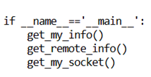

d) Jalankan program socket_info.py di mesin 1 dan mesin 2 dengan command : `python3 socket_info.py`. lalu analisis pada wireshark pilih interface `eth 0` karena ada traffic yang berjalan.

**Pada Mesin-1 :**

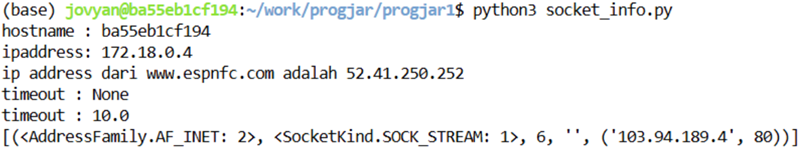

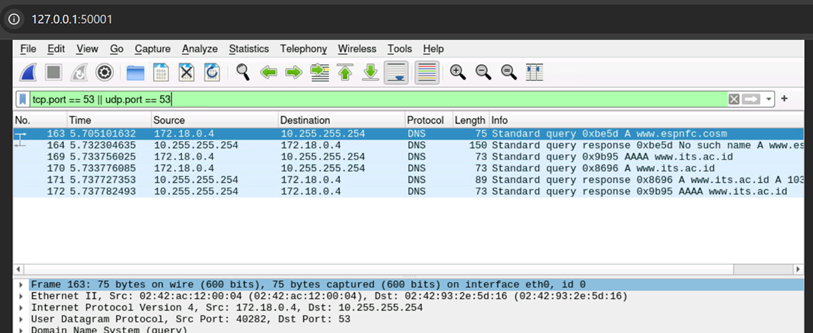

**Pada Mesin-2 :**

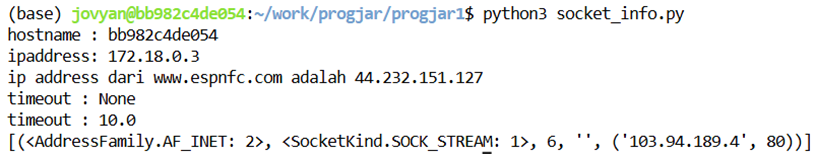

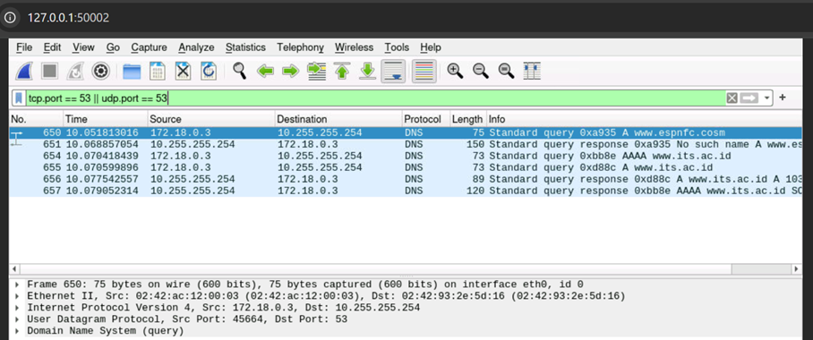

**Analisis :**

Program menggunakan protokol TCP yang berjalan dalam satu kali eksekusi. Proses komunikasi terjadi dalam dua tahap:

1. Program melakukan koneksi ke www.espnfc.com dan menerima respons balik di mesin 1.

2. Program melakukan koneksi ke DNS its.ac.id melalui port 53 untuk melakukan DNS lookup. Proses ini melibatkan:
   - Pencarian A record (IPv4) dan AAAA record (IPv6)
   - Komunikasi dari IP asal 172.18.0.4 ke IP tujuan 10.255.255.254
   - Penerimaan respons persetujuan komunikasi dari its.ac.id

Hasil yang sama terlihat di mesin 2, hanya berbeda pada IP asal (172.18.0.3).

Filter port 53 digunakan di Wireshark karena fungsi socket.getaddrinfo() memicu DNS lookup query untuk menerjemahkan nama domain menjadi alamat IP.

## 2. Jalankan server.py di mesin-1 dan client.py di mesin-2, sesuaikan isi program, pastikan komunikasi dapat dilakukan, capturelah hasilnya, lakukan analisis menggunakan wireshark, capture hasilnya

**Jawab :**

Langkah-langkah pengerjaan : 

a) Pertama ubah server_address pada file `client.py` pada mesin2 dari `localhost` menjadi `172.16.16.101`.

b) Jalankan program dengan command `python3 server.py` pada mesin1 dan `python3 client.py` pada mesin2.

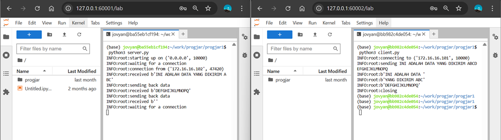

c) Melakukan analisis dari wireshark yang hasilnya : 

**Pada Mesin 1 :**

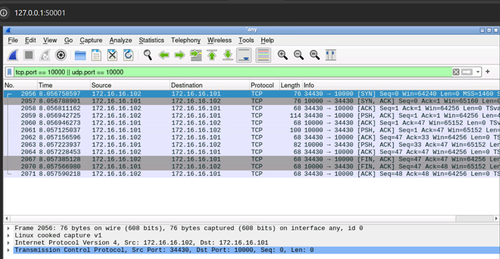

**Analisis :**

Server berjalan di Mesin 1 dengan konfigurasi mendengarkan (listen) pada semua alamat IP `0.0.0.0` di port `10000`. Sementara itu, Mesin 2 berfungsi sebagai client yang mengirimkan data dalam format byte. Proses pengiriman data dilakukan melalui perintah `sock.sendall(message.encode())` dalam skrip `client.py`, yang mengirimkan pesan `b'INI ADALAH DATA YANG DIKIRIM ABCDEFGHIJKLMNOPQ'` ke server di alamat `172.16.16.101:10000.` Setelah menerima data, server melakukan pemrosesan dan mengirimkan respons balik.

Karena TCP menggunakan protokol berbasis aliran (stream), client menerima respons dari server dalam bentuk potongan-potongan data (chunks), seperti `b'INI ADALAH DATA '`. Fenomena ini terjadi karena data dipisahkan sesuai dengan kapasitas buffer internal sistem. Proses komunikasi diakhiri ketika client menutup koneksi, yang ditandai dengan server menerima empty bytes `(b'') `sebagai sinyal end-of-stream. Dengan mekanisme ini, komunikasi antara server dan client melalui socket Python berjalan secara terstruktur dan efisien, memastikan pengiriman data byte per byte berlangsung dengan baik.

3.  Jalankan kembali soal nomor 2, namun kali ini rubahlah komunikasi agar berjalan di port 32444, kirimkan isi sebuah file, dan capturelah hasilnya, lakukan analisis menggunakan wireshark, capture hasilnya

**Jawab :**

Langkah - langkah pengerjaan : 

a) Ubah port di file `server.py` menjadi `32444` di mesin-1 dengan command : `vim server.py` untuk edit file 

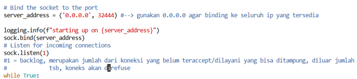

b) Ubah port di file `client.py` menjadi `32444` di mesin-2 dengan command : `vim client.py`

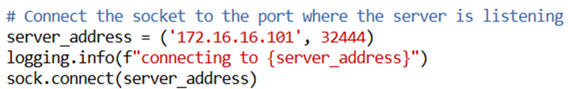

c) Jalankan program `server.py` di mesin-1 dan `client.py` di mesin 2. Kemudian lakukan analisis di wireshark.

**Pada Mesin-1 :**

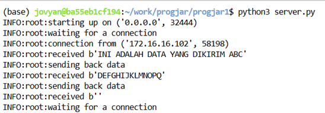

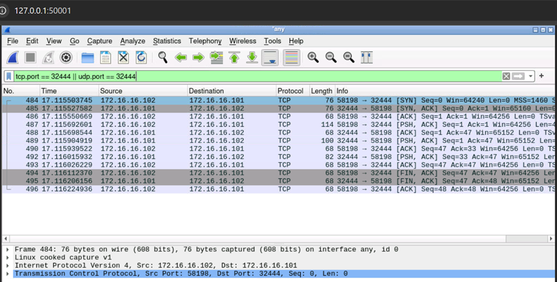

**Pada Mesin-2 :**

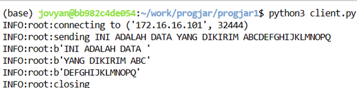

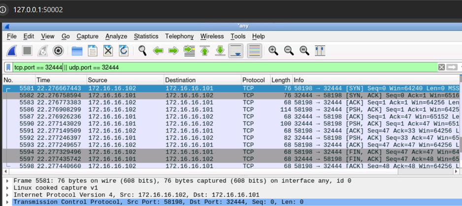

**Analisis :**

Server Python berjalan di Mesin 1 dengan konfigurasi mendengarkan (listen) pada semua alamat IP `0.0.0.0` di port `32444`. Sementara itu, Mesin 2 berfungsi sebagai client yang melakukan koneksi TCP ke alamat `172.16.16.101:32444`. Proses komunikasi dimulai ketika client mengirimkan data dalam format byte menggunakan perintah `sock.sendall(message.encode())`, yang mengirimkan pesan` b'INI ADALAH DATA YANG DIKIRIM ABCDEFGHIJKLMNOPQ'` ke server.

Setelah menerima data, server melakukan pemrosesan dan mengirimkan respons balik. Karena TCP menggunakan protokol berbasis aliran `stream`, client menerima respons dalam bentuk potongan-potongan data `chunks`, seperti `b'INI ADALAH DATA '`, sesuai dengan kapasitas buffer sistem. Proses komunikasi diakhiri melalui serangkaian tahapan: client mengirim segmen `FIN`, server merespons dengan `ACK`, server mengirim `FIN`, dan client mengirim `ACK` terakhir. Sinyal empty bytes `(b'')` pada server menandai berakhirnya aliran data.

Seluruh sesi komunikasi berjalan secara terstruktur, dimulai dari three-way handshake, dilanjutkan dengan pertukaran data byte-by-byte, dan diakhiri dengan four-way `FIN/ACK` teardown. Mekanisme ini memastikan komunikasi yang handal dan teratur antara server dan client melalui socket Python.

4. Jalankan client di mesin-2 dan mesin-3 dengan server berada di mesin-1, jalankan client secara bersamaan, apakah yang terjadi? capturelah hasilnya, lakukan analisis menggunakan wireshark, capture hasilnya

Langkah-langkah pengerjaan :

a) Ubah port pada `client.py` di mesin-3 menjadi `32444` dan ubah server address dari `localhost` menjadi `172.16.16.101` dengan command : `vim client.py` untuk mengedit file.

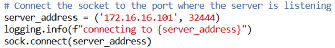

b) Jalankan program server.py di mesin 1 dan client.py di mesin 2 dan mesin 3

c) Lakukan analisis pada wireshark dengan hasil :

**Pada Mesin-1 :**

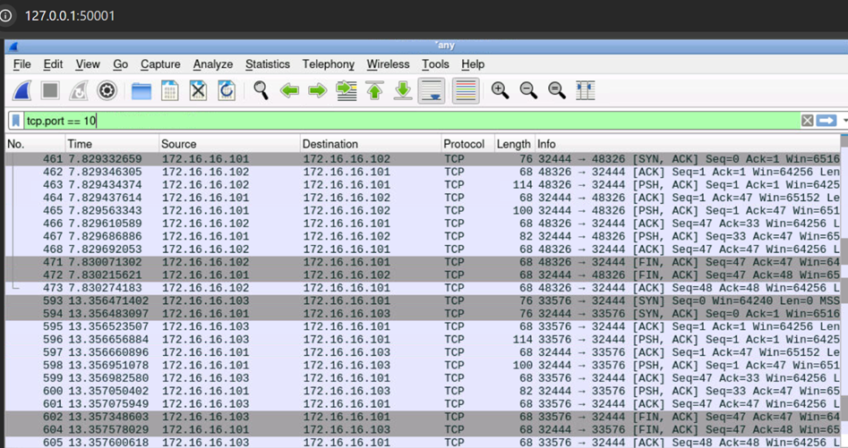

**Pada Mesin-2 :**

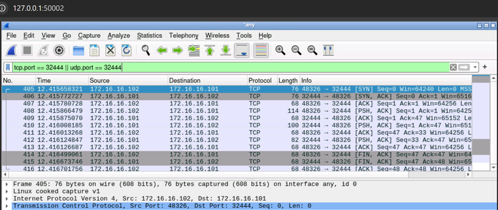

**Pada Mesin-3 :**

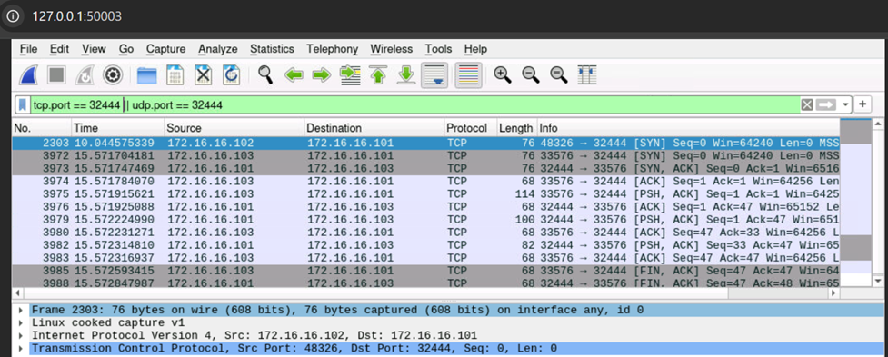

**Analisis :**

Saat client di mesin-2 dan mesin-3 dijalankan bersamaan untuk terhubung ke server di mesin-1, hasil tangkapan Wireshark memperlihatkan bahwa server hanya menangani satu koneksi dalam satu waktu. Awalnya, mesin-2 memulai komunikasi dengan mengirim paket `SYN` ke `172.16.16.101:32444`. Server membalas dengan `SYN-ACK`, kemudian direspons `ACK` oleh mesin-2, menyelesaikan proses handshake. Setelah pertukaran data selesai, mesin-2 mengirim `FIN` yang dibalas `ACK` oleh server, mengakhiri koneksi.

Baru setelah sesi mesin-2 sepenuhnya terputus, server mulai merespons koneksi dari mesin-3. Proses yang terjadi sama persis: handshake, transfer data, dan teardown mengikuti pola yang sama.

Hal ini menunjukkan bahwa server hanya memiliki satu socket untuk menerima koneksi `accept`, sehingga koneksi dari mesin-3 harus menunggu giliran. Akibatnya, urutan paket di Wireshark tampak bersifat sekuensial: rangkaian `SYN–SYN‑ACK–ACK–FIN/ACK` dari mesin-2 diikuti oleh rangkaian serupa dari mesin-3. Meskipun kedua client dijalankan secara paralel, komunikasi tetap berlangsung satu per satu.# PROGJAR24
