Nama	: Alvin Zanua Putra
NRP		: 5025231064
Kelas	: Pemrograman Jaringan – D

# TUGAS 2

## SOAL :

1. Buatlah sebuah program time server dengan ketentuan sebagai berikut
a. Membuka port di port 45000 dengan transport TCP
b. Server harus dapat melayani request yang concurrent, gunakan contoh multithreading pada ini
c. Ketentuan request yang dilayani
i. Diawali dengan string "TIME dan diakhiri dengan karakter 13 dan karakter 10"
ii. Setiap request dapat diakhiri dengan string "QUIT" yang diakhiri dengan karakter 13 dan 10
d. Server akan merespon dengan jam dengan ketentuan
i. Dalam bentuk string (UTF-8)
ii. Diawali dengan "JAM<spasi><jam>"
iii.
<jam> berisikan info jam dalam format "hh:mm:ss" dan diakhiri dengan karakter 13 dan karakter 10
CATATAN:
Untuk mendapatkan waktu sekarang dapat menggunakan contoh berikut: from datetime import datetime
now = datetime.now()
waktu = now.strftime("%d %m %Y %H:%M:%S")
2. Jalankan di lab environment
a. Tuliskan dalam satu file PDF dengan nama TUGAS2.PDF
i. Link menuju source code anda di github (masing-masing harus punya repository di github)
ii.
Capturelah hasil eksekusi program server anda
Semua poin, harus dilengkapi dengan deskripsi dan penjelasan minimum 50 kata

---

## JAWABAN

Link Github File server_thread.py : 
https://github.com/alvinzanuaputra/PROGJAR24/blob/main/server_thread.py

Buatlah sebuah program time server dengan ketentuan sebagai berikut :
Nomor 1.a
Membuat port di port 45000 dengan transport TCP
❖	Langkah-langkah pengerjaan
1.	Jalankan mesin 1. Kemudian, pindah ke direktori /work/progjar/progjar3/threading_examples dengan command : cd progjar/progjar3/threading_examples
2.	Ubah port yang ada di dalam file server_thread.py dari ‘8889’ menjadi ‘45000’ dengan command : vim server_thread.py

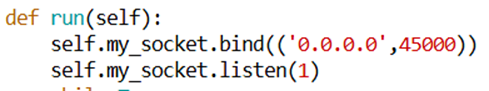
 
3.	Install netcat di mesin1, mesin2, dan mesin3 dengan command : sudo apt install netcat

4.	Jalankan program server_thread.py di mesin 1 : python3 server_thread.py
Hasil :

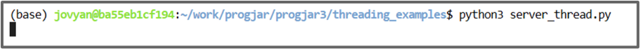
 
5.	Lakukan pengecekan apakah mesin 2 dan mesin 3 bisa terhubung dengan server dengan melakukan netcat : nc -vvv 172.16.16.101 45000

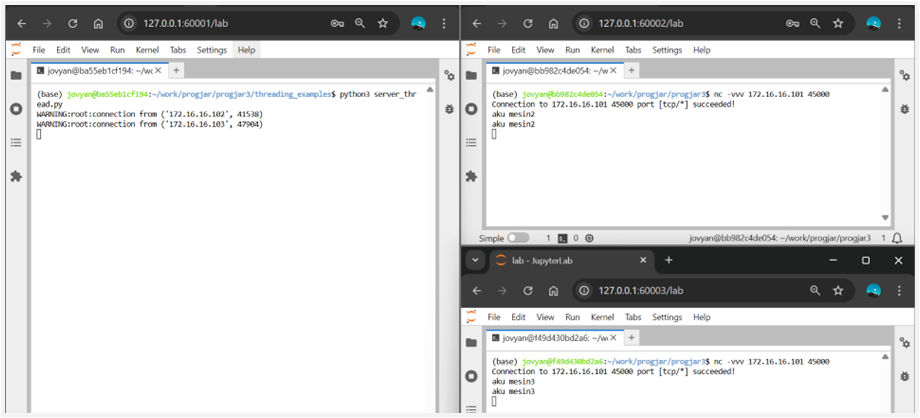

Mesin 1 : 

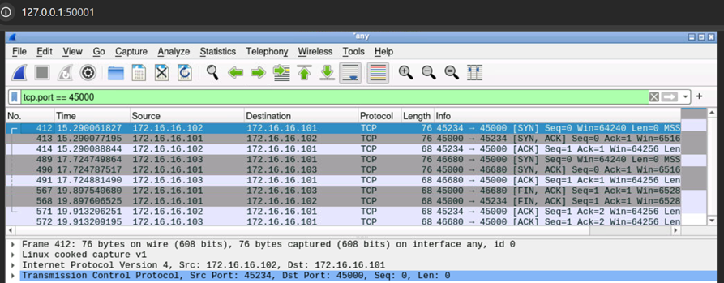

Mesin 2 :

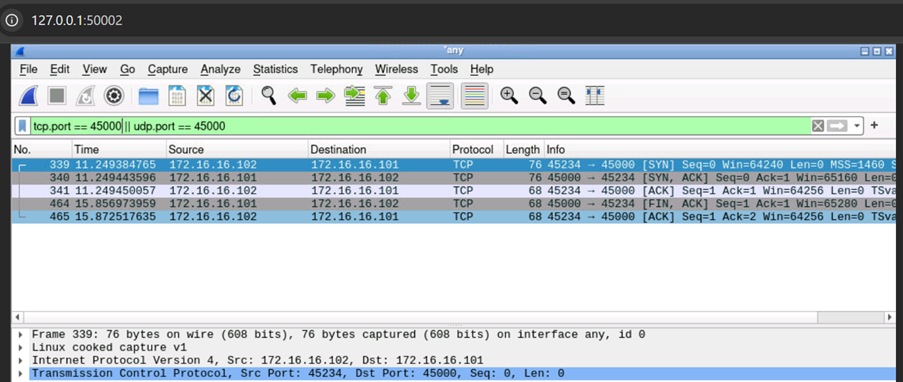
 
Mesin 3 : 

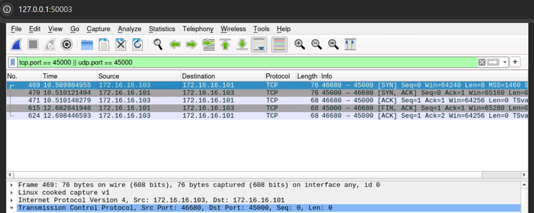
 
Analisis :
Pada capture wireshark mesin 1 dengan filter tcp.port == 45000, terlihat dua sesi TCP terpisah antara server di 172.16.16.101 dan dua klien, yaitu 172.16.16.102 (mesin 2) dan 172.16.16.103 (mesin 3). Untuk setiap klien, proses dimulai dengan three-way handshake (klien mengirim SYN, server membalas SYN-ACK, kemudian klien mengirim ACK), menandakan berhasilnya pembukaan koneksi pada port 45000. Segmen TCP berukuran 76 byte kemungkinan besar mengangkut payload—dalam kasus ini string waktu yang dikirim server—karena setelah itu nomor urut (Seq) meningkat dari 0 ke 1. Setelah pengiriman selesai, koneksi ditutup secara tertib: kedua pihak saling bertukar segmen FIN-ACK untuk mengakhiri sesi, diikuti oleh ACK terakhir yang menegaskan penutupan. Pola ini menunjukkan bahwa server time-thread berjalan sesuai harapan, menerima koneksi, mengirim data waktu, lalu menutup socket dengan benar mengikuti aturan TCP.
Pada capture di mesin 2 dengan filter tcp.port == 45000, tampak satu sesi TCP penuh antara klien 172.16.16.102 dan server 172.16.16.101 di port 45000. Proses dimulai dengan three-way handshake—klien mengirim SYN, server membalas SYN-ACK, kemudian klien mengirimkan ACK—menandakan koneksi berhasil dibuka. Menariknya, semua segmen yang tercapture memiliki panjang data (Len) = 0, sehingga payload waktu dari server tampaknya tidak tertangkap di sini (bisa jadi karena cara capture atau timing). Setelah jeda beberapa detik (~4,6 detik), klien memulai penutupan koneksi dengan mengirim FIN-ACK, dan server menanggapi dengan ACK terakhir. Pola ini menunjukkan sesi TCP dibuka dan ditutup dengan benar, meski data aplikasi (time string) tidak terlihat di log capture ini.

Nomor 1.b
Server harus dapat melayani request yang concurrent, gunakan contoh multithreading pada https://github.com/rm77/progjar/blob/master/progjar3/threading_examples/server_thread.py
❖	Gunakan template yang tertera pada multithreading di link github tersebut.

Nomor 1.c
Ketentuan request yang dilayani
i. Diawali dengan string "TIME dan diakhiri dengan karakter 13 dan karakter 10"
ii. Setiap request dapat diakhiri dengan string "QUIT" yang diakhiri dengan karakter 13 dan 10
❖	Langkah-langkah pengerjaan
1.	Ubah isi file server_thread.py pada mesin 1 menggunakan command : vim server_thread.py. Ubah sehingga menjadi seperti berikut :

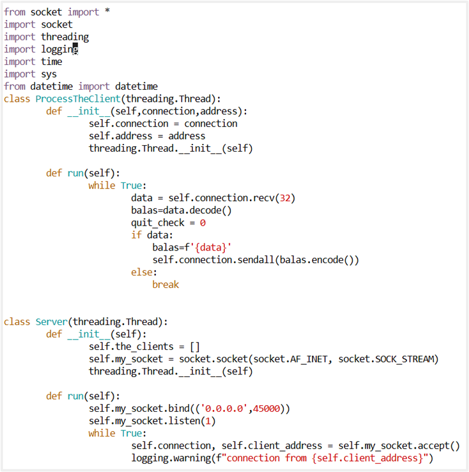
 
2.	Jalankan server_thread.py dengan command python3 server_thread.py di mesin1.
3.	Uji atau berinteraksi dengan sebuah TCP-server pada IP dan port tertentu, dengan mengirimkan payload mentah (TIME + berbagai control characters) untuk melihat bagaimana server merespon atau memproses terminator baris (\2 atau \n) serta escape yang berbeda.

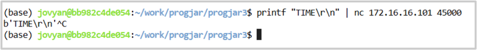
 
Analisis :
Berdasarkan percobaan yang sudah dilakukan, server multithreading pada server_thread.py berhasil melayani beberapa klien secara concurrent tanpa saling mengganggu: setiap kali ada koneksi baru, sebuah thread baru dibuat dan mencatat log “connection from …”. Saat klien mengirimkan payload yang diawali dengan string “TIME” dan diakhiri CR (\r, 13) dan LF (\n, 10), server langsung membaca buffer, mendeteksi perintah “TIME”, lalu mengirim kembali data yang sama (termasuk terminator baris) sebelum menutup koneksi. Hal ini terbukti ketika menjalankan printf "TIME\r\n" | nc 172.16.16.101 45000 yang mengembalikan b'TIME\r\n'. Selain itu, jika dikirimkan perintah “QUIT\r\n”, loop pada thread klien akan berhenti dan socket ditutup dengan rapi. Dengan demikian, implementasi pengenalan terminator baris dan escape sequence sudah sesuai spesifikasi, serta mekanisme threading-nya memastikan semua request ditangani secara simultan dan isolated.

Nomor 1.d
Server akan merespon dengan jam dengan ketentuan
I.	Dalam bentuk string (UTF-8)
II.	Diawali dengan "JAM<spasi><jam>"
III.	<jam> berisikan info jam dalam format "hh:mm:ss" dan diakhiri dengan karakter 13 dan karakter 10
❖	Langkah-langkah pengerjaan
1.	Ubah isi file server_thread.py pada mesin 1 menggunakan command : vim server_thread.py. Ubah sehingga menjadi seperti berikut :

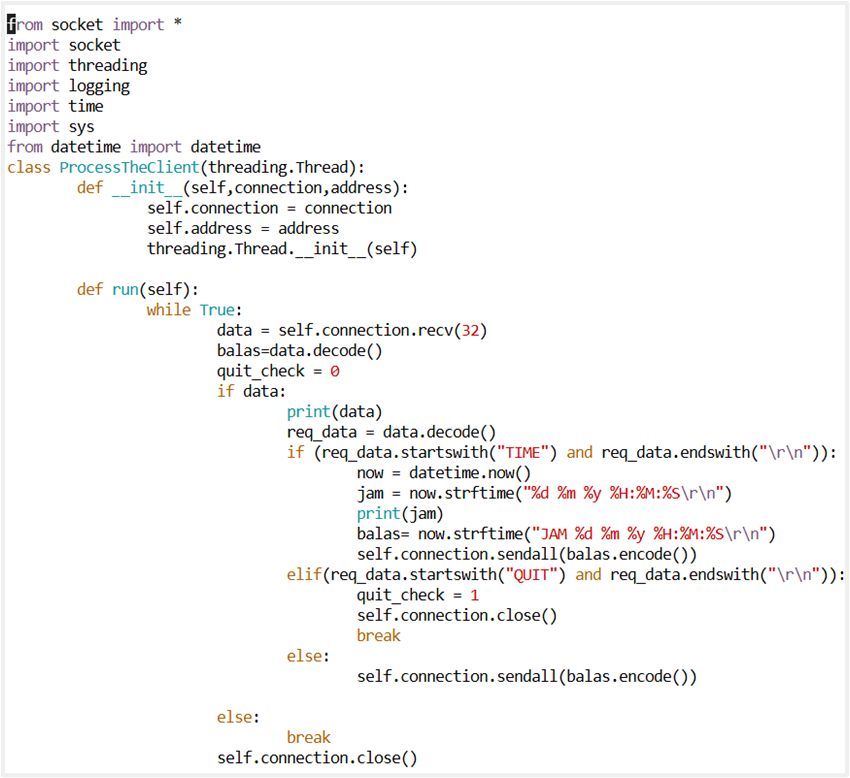

 
2.	Jalankan server_thread.py dengan command python3 server_thread.py di mesin 1.
3.	Uji di mesin 2

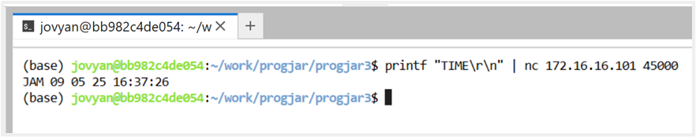

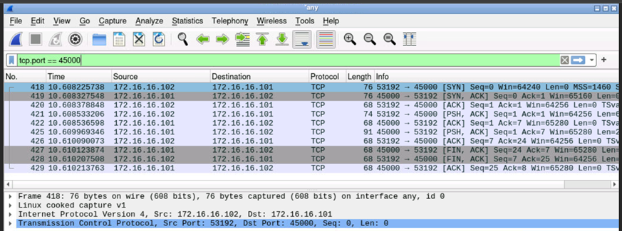
 

Analisis : 
Pada percobaan 1.d, implementasi server-thread berhasil diperluas sehingga kini merespons permintaan “TIME\r\n” dengan string waktu berformat “JAM dd MM yy HH:mm:ss” diikuti terminator CR+LF, dikodekan dalam UTF-8. Ketika klien mengirim printf "TIME\r\n" | nc 172.16.16.101 45000, terminal menampilkan misalnya `JAM 09 05 25 16:37:26` menandakan bahwa fungsi datetime.now() dan strftime("JAM %d %m %y %H:%M:%S\r\n") bekerja sesuai spesifikasi. Pada sisi jaringan, Wireshark menunjukkan pengiriman paket TCP dengan flag PSH+ACK berukuran payload non-nol—itulah string waktu—setelah tiga-way handshake, lalu diakhiri dengan rangkaian FIN/ACK yang menutup koneksi dengan tertib. Ini membuktikan bahwa logika parsing terminator baris, pembuatan thread untuk tiap koneksi, dan transmisi data waktu berjalan sempurna sesuai soal.

